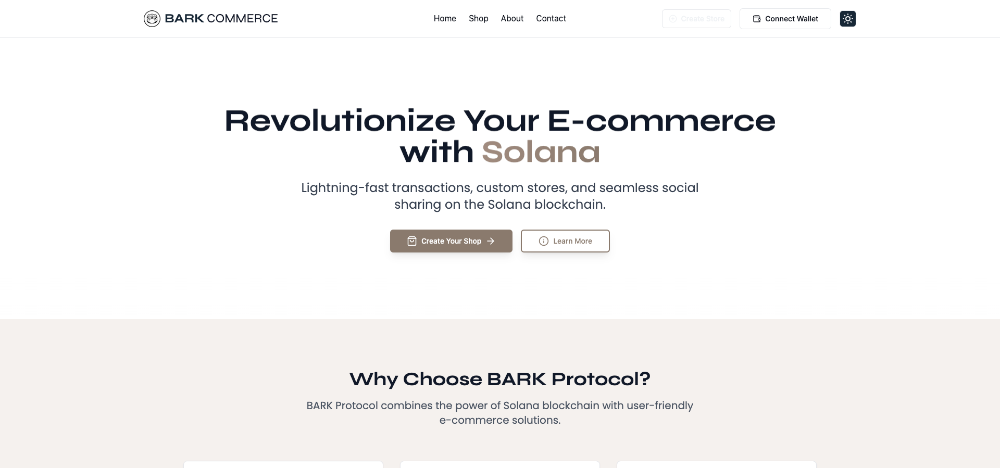
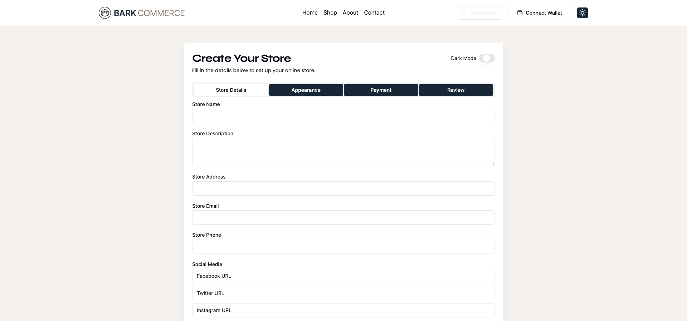

# BARK E-Commerce Platform

## Overview

The BARK E-Commerce Platform offers a seamless way to create and manage online stores with integrated Solana wallet connections. Our platform ensures secure payments, dynamic previews, and smooth store setup for merchants, leveraging the power of blockchain technology.



!

## Features

- **Store Setup**: Easily set up and manage your store, add products, and configure payment and shipping settings.
- **Sharing Store Links**: Generate custom links and share them on social media with dynamic previews.
- **Solana Wallet Integration**: Securely connect Solana wallets like Phantom, Solflare, and Backpack to make payments and manage digital assets.
- **Dynamic Store Links**: Share unique store links on social media with previews for a streamlined shopping experience.
- **Payment Handling**: Secure payments via an escrow system with automatic refunds in case of disputes or cancellations.

```commerce
src/
├── app/
│   ├── (auth)/
│   │   ├── login/
│   │   │   └── page.tsx
│   │   ├── register/
│   │   │   └── page.tsx
│   │   └── layout.tsx
│   ├── (shop)/
│   │   ├── products/
│   │   │   ├── [id]/
│   │   │   │   └── page.tsx
│   │   │   └── page.tsx
│   │   ├── categories/
│   │   │   ├── [category]/
│   │   │   │   └── page.tsx
│   │   │   └── page.tsx
│   │   ├── cart/
│   │   │   └── page.tsx
│   │   ├── checkout/
│   │   │   └── page.tsx
│   │   └── layout.tsx
│   ├── (merchant)/
│   │   ├── dashboard/
│   │   │   └── page.tsx
│   │   ├── products/
│   │   │   ├── create/
│   │   │   │   └── page.tsx
│   │   │   ├── edit/
│   │   │   │   ├── [id]/
│   │   │   │   │   └── page.tsx
│   │   │   │   └── page.tsx
│   │   │   └── page.tsx
│   │   ├── orders/
│   │   │   └── page.tsx
│   │   ├── settings/
│   │   │   └── page.tsx
│   │   └── layout.tsx
│   ├── api/
│   │   ├── auth/
│   │   │   └── [...nextauth].ts
│   │   ├── products/
│   │   │   └── route.ts
│   │   ├── orders/
│   │   │   └── route.ts
│   │   └── webhook/
│   │       └── route.ts
│   ├── about/
│   │   └── page.tsx
│   ├── contact/
│   │   └── page.tsx
│   ├── page.tsx
│   └── layout.tsx
├── components/
│   ├── ui/
│   │   ├── button.tsx
│   │   ├── input.tsx
│   │   ├── card.tsx
│   │   └── ...
│   ├── layout/
│   │   ├── header.tsx
│   │   ├── footer.tsx
│   │   ├── main-header.tsx
│   │   └── shop-header.tsx
│   ├── products/
│   │   ├── product-card.tsx
│   │   ├── product-list.tsx
│   │   └── product-details.tsx
│   ├── cart/
│   │   ├── cart-item.tsx
│   │   └── cart-summary.tsx
│   ├── checkout/
│   │   ├── checkout-form.tsx
│   │   └── payment-methods.tsx
│   └── merchant/
│       ├── product-form.tsx
│       └── order-list.tsx
├── lib/
│   ├── utils.ts
│   ├── api.ts
│   └── db.ts
├── hooks/
│   ├── use-cart.ts
│   ├── use-auth.ts
│   └── use-products.ts
├── styles/
│   └── globals.css
├── types/
│   ├── product.ts
│   ├── order.ts
│   └── user.ts
└── config/
    └── site.ts
```

## Getting Started

### Prerequisites

- Node.js (v14 or later)
- npm (v6 or later) or yarn (v1.22 or later)
- Prisma CLI
- Solana wallet (Phantom, Solflare, or Backpack)

### Installation

1. **Clone the Repository**:
   ```bash
   git clone https://github.com/barkprotocol/blink-commerce.git
   cd blink-commerce
   ```

2. **Install Dependencies**:
   ```bash
   pnpm install
   # or
   yarn install
   ```

3. **Configure Environment Variables**:
   Create a `.env` file in the root directory and add the following:
   ```env
   DATABASE_URL=your-database-url
   NEXT_PUBLIC_SOLANA_NETWORK=devnet
   NEXT_PUBLIC_SOLANA_RPC_URL=https://api.devnet.solana.com
   NEXT_PUBLIC_PAYMENT_GATEWAY_API_KEY=your-payment-gateway-api-key
   ```

4. **Run Migrations**:
   ```bash
   npx prisma migrate dev
   ```

5. **Start the Development Server**:
   ```bash
   npm run dev
   # or
   yarn dev
   ```

Open [http://localhost:3000](http://localhost:3000) with your browser to see the result.

## Usage Guide

### 1. Store Setup

#### Sign Up
1. Navigate to the registration page and provide your email, password, and store name.
2. Verify your email address to activate your account.

#### Add Products
1. Log in to your dashboard.
2. Click on "Add Product" and fill in the details:
   - Upload product images
   - Enter product titles and descriptions
   - Set prices and manage stock quantities
   - Assign products to categories

#### Configure Settings
1. Go to the "Store Settings" section.
2. Set up payment options, shipping methods, and tax settings.

#### Publish Your Store
1. Review your store setup.
2. Click "Publish" to make your store live.

### 2. Sharing Store Links

1. From your dashboard, click on "Generate Store Link".
2. Customize your store URL if desired.
3. Use the provided social media buttons to share your store link on various platforms.

### 3. Payment Handling

- Payments are automatically processed through our secure escrow system.
- Funds are held until the order is confirmed as completed.
- In case of disputes or cancellations, refunds are processed automatically.

## Development

### Tech Stack

- Next.js 13+
- TypeScript
- Prisma (ORM)
- Tailwind CSS
- Solana Web3.js

### API Routes

Our API routes are defined in `app/actions.json/route.ts`. They handle:

- Store creation and management
- Product CRUD operations
- Custom link generation
- Payment processing

For detailed API documentation, please refer to our [API Documentation](docs/API.md).

## Contributing

We welcome contributions to the BARK E-Commerce Platform! Please follow these steps:

1. Fork the repository
2. Create your feature branch (`git checkout -b feature/AmazingFeature`)
3. Commit your changes (`git commit -m 'Add some AmazingFeature'`)
4. Push to the branch (`git push origin feature/AmazingFeature`)
5. Open a Pull Request

Please read [CONTRIBUTING.md](CONTRIBUTING.md) for details on our code of conduct and the process for submitting pull requests.

## License

This project is licensed under the MIT License - see the [LICENSE](LICENSE) file for details.

## ToDo

- Modular and need to refactored
- Merchant Dashboard
- User Account
- Solana wallet login
- Hide main-navbar when create shop is activated

## Acknowledgements

- [Solana](https://solana.com/) for providing the blockchain infrastructure
- [Next.js](https://nextjs.org/) for the fantastic React framework
- [Prisma](https://www.prisma.io/) for the powerful ORM